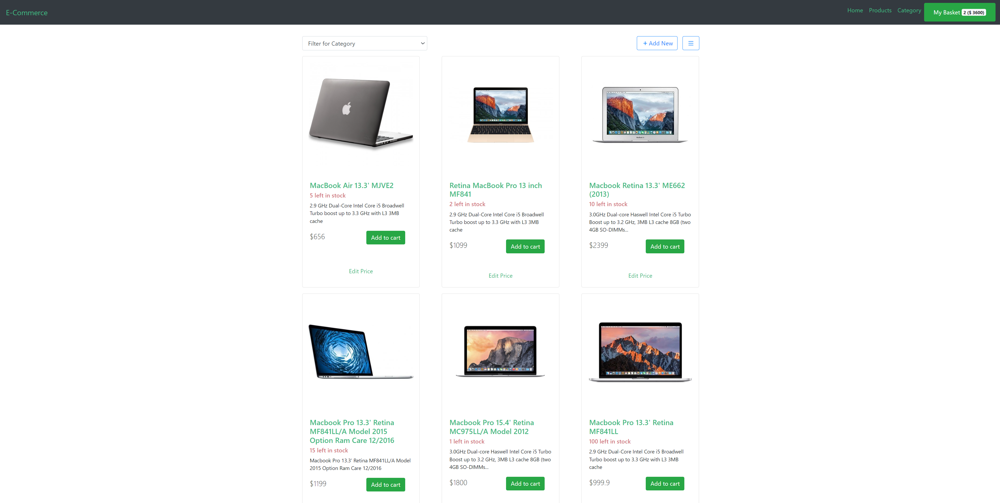
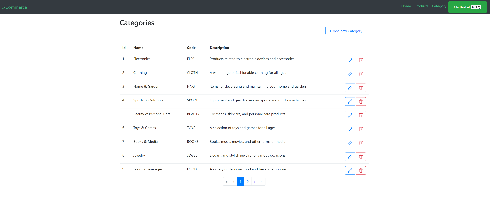

# e-commorce

## Project setup
```
npm install
```

### Compiles and hot-reloads for development
```
npm run serve
```

### Compiles and minifies for production
```
npm run build
```

### Lints and fixes files
```
npm run lint
```

### Customize configuration
See [Configuration Reference](https://cli.vuejs.org/config/).


## Features

This project implements basic shopping cart features:
* Products / Categories
* Pull products list from API
* Pull categories list from API
* Add/Remove item to shopping cart

## Technical details

* VueJS [2.7.5]
* [Bootstrap 4](https://getbootstrap.com/)
* [BootstrapVue](https://bootstrap-vue.org/)
* [MockAPI](https://mockapi.io/)

## Demo

Checkout demo at [Demo](https://victorious-plant-0d9987e03.3.azurestaticapps.net/)



